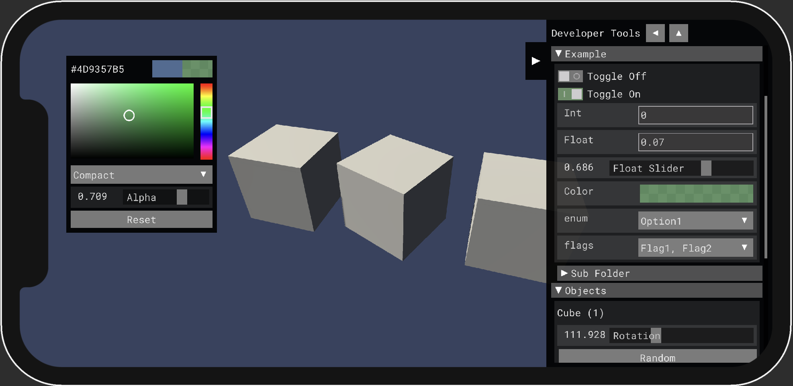

# DevGUI

In-game developer tools panel made with imgui



- [DevGUI](#devgui)
  - [Setup](#setup)
    - [Package Manager](#package-manager)
  - [Usage](#usage)
    - [Creating Instance](#creating-instance)
    - [Adding GUI](#adding-gui)
    - [Available DevGUI Widgets](#available-devgui-widgets)
  - [Prevent background input](#prevent-background-input)
  - [Enabling / Disabling DevGUI](#enabling--disabling-devgui)

## Setup

### Package Manager
- Press `+` button and select `Add package from git URL...`
- Paste URL of this repo `git@github.com:a-gruzdev/DevGUI.git`

Or clone repository somewhere and add as local package

Or just copy the files right into your project

## Usage

there are some sample scripts in `Samples~/SamplesDevGUI/Scripts` folder, that can be imported in project with the Package Manager.

### Creating Instance

- **With code**

If your project has any initialization code using [RuntimeInitializeOnLoadMethod](https://docs.unity3d.com/ScriptReference/RuntimeInitializeOnLoadMethodAttribute.html), then you can create instance there

```csharp
var devGUI = DevGUI.Create(showDeviceInfo = true, dontDestroyOnLoad = true);
```

It is also possible to setup custom reference resolution and panel width
```csharp
devGUI.Resolution
devGUI.PanelWidth
```

- **With GameObject**

If your project has only one scene you can just put `DevGUI` script on any object in the scene, but keep in mind that only one instance of `DevGUI` is allowed.

### Adding GUI

Note that DevGUI uses static list for storing gui functions, so `DevGUI.AddGUI` will work even if DevGUI instance is not present. Also you always have to remove your gui's with `DevGUI.RemoveGUI` if it's not static global functions.

```csharp
private void OnEnable() => DevGUI.AddGUI("Example", OnDevGUI);
private void OnDisable() => DevGUI.RemoveGUI("Example", OnDevGUI);

private void OnDevGUI()
{
    // Unity imgui code
}
```

You can use any Unity's imgui widgets from `GUILayout` here, as well as `DevGUI` widgets.

**Button**
```csharp
if (GUILayout.Button("Button"))
{
    //button logic
}
```

**Label**
```csharp
GUILayout.Label("Label");
GUILayout.Label($"FPS: {1f / Time.unscaledDeltaTime}");
```

**Toggle**
```csharp
someBool = GUILayout.Toggle(someBool, "Toggle Example");
```

### Available DevGUI Widgets

```csharp
float Slider(string title, float value, float min, float max);
string TextField(string title, string text);
int IntField(string title, int value);
float FloatField(string title, float value);
Vector2 Vector2Field(string title, Vector2 value);
Vector3 Vector3Field(string title, Vector3 value);
Vector4 Vector4Field(string title, Vector4 value);
Vector2Int Vector2IntField(string title, Vector2Int value);
Vector3Int Vector3IntField(string title, Vector3Int value);
Color ColorField(string title, Color value);
T EnumField<T>(string title, T enumValue); //supports flags
```

## Prevent background input

Most likely you would want to prevent game ui buttons clicks that are under DevGUI panel when you use it.
For this case there is a [ImguiListener](Runtime/ImguiListener.cs) script in this package, you just need to add it to the object with unity's `EventSystem`, and that's it.

If you have RTS like input with ray casts in game world or something similar, it is also possible to handle this as well. Just add extra check in your code before ray casting

> it's not DevGUI bound and works with all unity's imgui controls
```csharp
if (GUIUtility.hotControl == 0 && Physics.Raycast(...))
{
    // input game logic
}
```

## Enabling / Disabling DevGUI

If you want to toggle DevGUI at runtime, you can just use `DevGUI.Instance.enabled` property for this.
